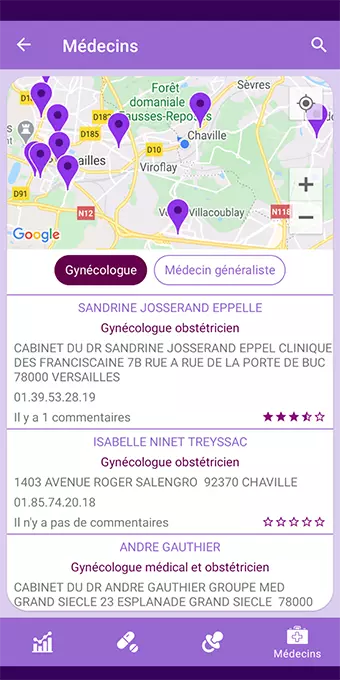

 
 
 
 
 

# Mon Endo

My Endo is an android application developed for women with entometriosis.
The various features of the application are however useful for all women.

## Table of contents

- [Features](#Features)  
- [Description](#Description)  
- [Quick start](#Quick-Start)  
- [Documentation](#Documentation)  
- [Screenshots](#Screenshots)  
- [Code Quality](#sonarcloud-results)

## Features

    - Auth with mail, Google, Facebook or anonymous login
    - Record all pain-related data in a local database
    - View all the recorded data in the form of graphs and filter them
    - Graphic representation and monitoring of contraceptive treatment
    - Possibility of adapting the tablet visual to the capacity of the user's tablet (28, 21 + 7, 21, 14, 12, 10)
    - Alert by notification for taking contraceptive treatment and reminder of the taking after one hour if the treatment is not validated
    - Automatic shutdown of notifications for tablets containing 21 pills and resume notifications after 7 days of shutdown
    - Addition of other treatments with the possibility of receiving notifications
    - Visual monitoring of taking other treatments
    - Calendar to visually follow the menstrual cycle
    - Calculation and indication of future cycles with fertility periods and ovulation days
    - Recording of body temperatures and graphical representation of them
    - Location of the user on a map with indication of general practitioners and gynecologists
    - Presentation of doctors based on comments and ratings left by other users
    - Search for doctors in a locality determined by the user
    - Possibility to leave a note and a comment about a doctor

## Description

This app is fully developped in Kotlin

Technical Stack :

    - MVVM architecture
    - Koin for dependency injection
    - Espresso and Barista to UiTests
    - Single Activity application
    - Navigation Component
    - Work Manager and BroadcastReceiver for notifications
    - Room for local database
    - FirebaseAuth
    - Firestore for comments storage
    - Retrofit for the api calls
    - CPAM api for doctors and Adresse.gouv api for the location searches
    - Google Map and Play services for the user's location
    - Kotlin coroutines for asynchronous work
    - MpAndroidChart for the charts

## Quick start

After downloading or clone the repository, you need to create a new project in Firebase and Google Cloud Platform (think to restrict your apikey with your SHA-1 and the correct API).  

In Google Cloud Platform you have to activate :  

    - Google Map

Add your google platform apikey in :

    - MonEndo/gradle.properties
      - GOOGLE_MAP_API_KEY="YOU_API_KEY_HERE"

In Firebase, you have to activate :

    - Auth (with all needed providers and their own key and secret key)
    - Firestore (nothing to do)

Add your Firebase configuration file in :

    - MonEndo/app/google-service.json

After these operations the app is ready.

## Documentation

You can find a french presentation of the app here:

[Go to documention](https://github.com/Benlefevre/MonEndoDemo/blob/main/MonEndoDemo.m4v)

## Screenshots

### Login

### DashBoard

### Pain Screen

### Symptoms Screen

### Activities Screen

### Sleep Screen

### Mood Screen

### Treatment

### Treatment 28 pills

### Treatment 21 + 7 pills

### Treatment 10 pills

### Fertility

### Doctor

### Doctor choice

### Doctor details

### Doctor search

### Doctor autocomplete

## SonarCloud results

I use SonarQube during the development and SonarCloud at the end.  
You can find sonar.gradle and jacoco.gradle in the project's root directory.

    -app/sonar.gradle
    -app/jacoco.gradle

Create a new project in SonarCloud or SonarQube and replace in sonar.gradle :

        property "sonar.host.url", "https://sonarcloud.io" or "https://localhost::9000"
        property "sonar.projectName", "Your_Project_Name"
        property "sonar.projectKey", "Your_Project_key"
        property "sonar.organization", "Your_organisation_name"

[SonarCloud results](https://sonarcloud.io/dashboard?id=Benlefevre_MonEndo)
